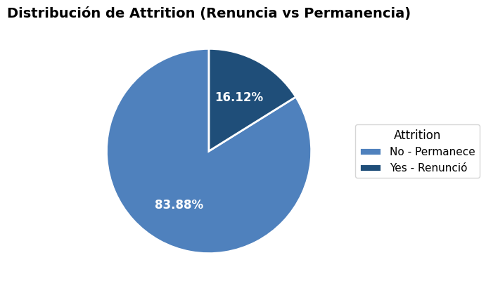
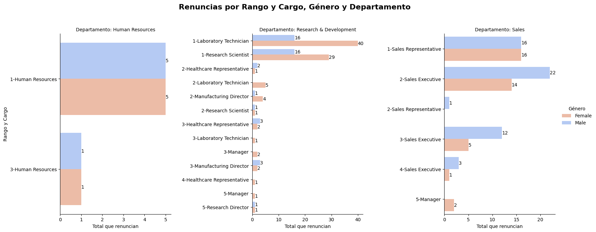
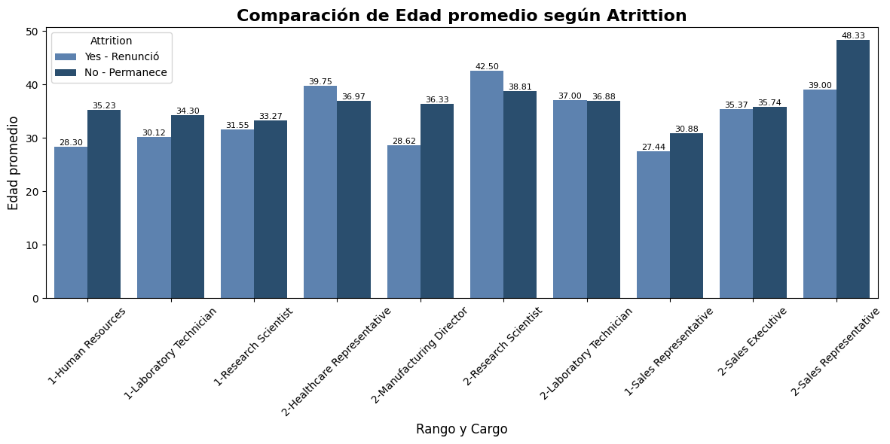
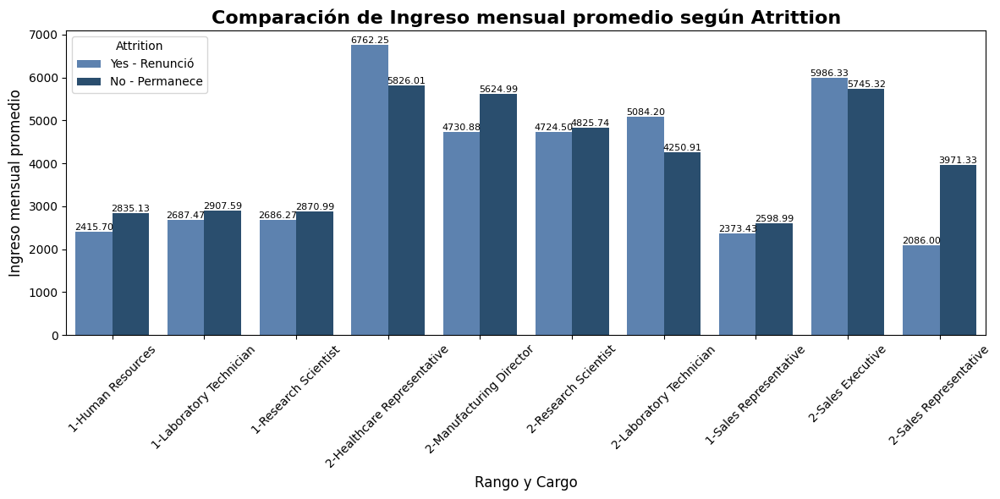
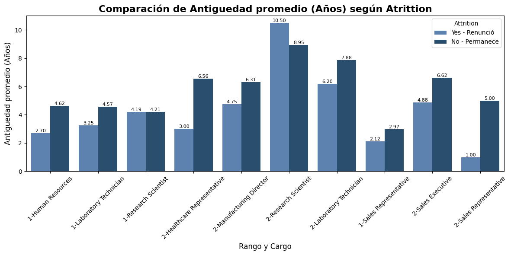
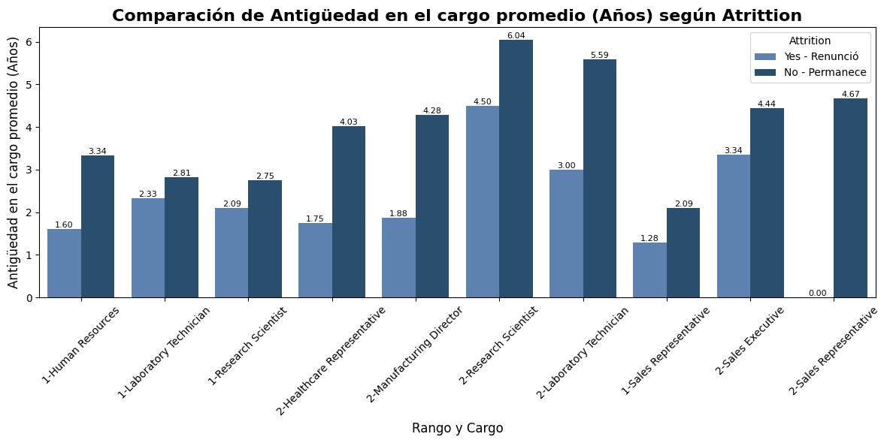
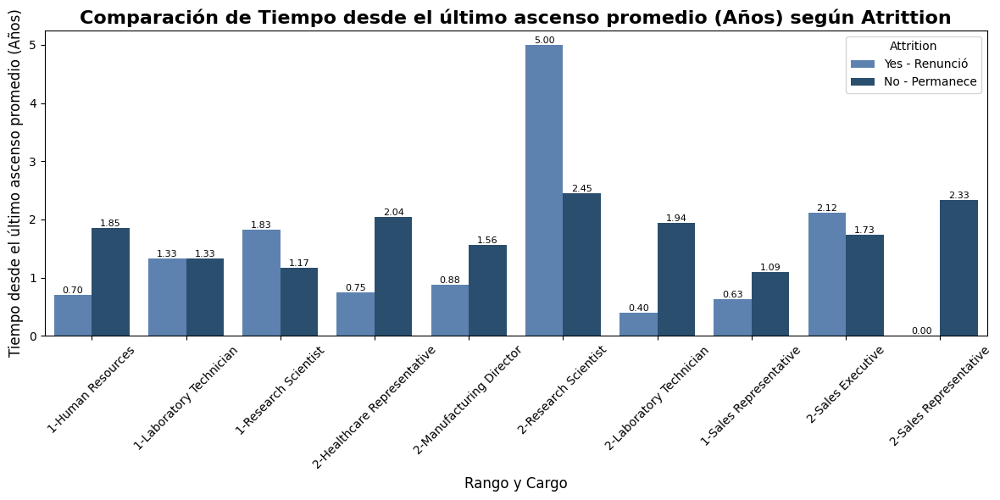

# **Project TalentFlow (People Analytics)**
## **Análisis de Rotación Laboral y Factores que Inciden en la Permanencia o Salida de Empleados**

## 1. Introducción

La rotación laboral es un indicador clave en Recursos Humanos, ya que impacta directamente en:

- Costos de reclutamiento  
- Productividad  
- Transferencia de conocimiento  
- Clima organizacional  
- Desempeño general del negocio  

**TalentFlow** es una iniciativa analítica orientada a comprender los factores que explican la renuncia (Attrition) dentro de una organización ficticia, combinando técnicas estadísticas, visualización de datos y principios de People Analytics.

El proyecto busca:

- Identificar patrones asociados a la renuncia.  
- Analizar diferencias entre empleados que permanecen y los que salen.  
- Detectar variables críticas (edad, antigüedad, ascensos, ingresos).  
- Proponer recomendaciones accionables para fortalecer la retención.  

---

## 2. Descripción del Dataset

El dataset contiene información laboral, salarial y demográfica de aproximadamente **1,470 empleados**, con **36 variables** en total y **22 variables** de interés.

### Diccionario de Datos

| Variable | Tipo | Descripción |
|---------|------|-------------|
| `Age` | int | Edad del empleado |
| `Attrition` | object | Renunció (Yes) o permanece (No) |
| `BusinessTravel` | object | Frecuencia de viajes laborales |
| `DailyRate` | int | Pago diario |
| `Department` | object | Área o departamento al que pertenece |
| `DistanceFromHome` | int | Distancia del hogar al trabajo |
| `Education` | int | Nivel educativo |
| `EducationField` | object | Área de formación |
| `Gender` | object | Género |
| `HourlyRate` | int | Pago por hora |
| `JobLevel` | int | Nivel jerárquico |
| `JobRole` | object | Cargo desempeñado |
| `MaritalStatus` | object | Estado civil |
| `MonthlyIncome` | int | Ingreso mensual |
| `NumCompaniesWorked` | int | Número de empleadores previos |
| `OverTime` | object | Indica si realiza horas extra |
| `PercentSalaryHike` | int | Incremento salarial anual (%) |
| `TotalWorkingYears` | int | Años totales de experiencia |
| `YearsAtCompany` | int | Años en la compañía |
| `YearsInCurrentRole` | int | Años en el puesto actual |
| `YearsSinceLastPromotion` | int | Años desde el último ascenso |
| `YearsWithCurrManager` | int | Años con el mismo jefe |

---

## 3. Metodología de Trabajo

El análisis combinó limpieza, transformación, exploración gráfica y cálculos estadísticos.

### 3.1 Limpieza y Preprocesamiento

- Conversión de tipos  
- Eliminación de valores nulos  
- Estandarización de variables categóricas  

### 3.2 Creación de Variables Relevantes

```python
df['rango_rol'] = df['JobLevel'].astype(str).str.cat(df['JobRole'], sep='-')
```
Permite analizar diferencias por jerarquía y cargo en las visualizaciones de Attrition.

### 3.3 Agrupación para Cálculo de Métricas
```python
df_grouped = df.groupby(
    ['Department', 'Gender', 'JobLevel', 'JobRole']
).agg(
    Edad_Promedio=('Age', 'mean'),
    Ingreso_Promedio=('MonthlyIncome', 'mean'),
    Antiguedad_Promedio=('YearsAtCompany', 'mean'),
    RolAnios_Promedio=('YearsInCurrentRole', 'mean'),
    UltimoAscenso_Promedio=('YearsSinceLastPromotion', 'mean')
).reset_index()
```
Permite encontrar patrones de permanencia y renuncia por nivel y cargo.

## 4. Análisis Exploratorio (EDA) y Principales Hallazgos

### 4.1 Rotación General

- Más de 1,200 empleados permanecen en la empresa.
- Cerca de 240 empleados han renunciado, representando ~20%.
- De continuar la tendencia, la tasa de renuncia podría incrementarse en el futuro.

### 4.2 Impacto de la rotación laboral por género

A nivel macro, esta visualización revela hallazgos relevantes:

- Las renuncias se concentran únicamente en tres departamentos de la empresa.
- Los rangos se alinean con el nivel del cargo: los niveles 1 y 2 corresponden a funciones operativas o iniciales; los niveles 3 y 4 abarcan cargos medios, senior o gerenciales; y el nivel 5 representa posiciones directivas o ejecutivas.
- En dos departamentos surge una tendencia clara por género: en Sales, los hombres renuncian con mayor frecuencia; mientras que en Research & Development, la renuncia es marcadamente mayor en mujeres. En Human Resources, la salida es equilibrada entre ambos géneros.
- Algunos cargos presentan renuncias asociadas exclusivamente a un solo género.
- En los departamentos con mayor rotación, los rangos más afectados son los niveles 1 y 2, correspondientes a roles operativos y técnicos.

### 4.3 Factores Asociados a la Renuncia (Attrition)

Este análisis se centra en los niveles 1 y 2, ya que, del total de personas que se van de la empresa, la mayor densidad poblacional se centra en estos dos niveles, por lo que conocer los posibles factores que influyen en estos dos niveles permite tomar futuras decisiones en beneficio de la empresa y actuar de manera preventiva en el grupo más afectado.

#### Edad Promedio

- En la mayoría de los cargos, quienes renuncian tienen una edad promedio menor que quienes permanecen.
- La renuncia se concentra en perfiles jóvenes y de menor trayectoria, especialmente en roles operativos.
- Los empleados de mayor edad muestran mayor estabilidad laboral, reduciendo su probabilidad de renuncia.

#### Ingreso Mensual

- En la mayoría de roles, el ingreso de quienes renuncian es similar o ligeramente inferior, descartando el salario como causa general de salida.
- En ventas operativas, quienes renuncian presentan ingresos notablemente más bajos, evidenciando riesgo salarial específico.
- En roles especializados como “Healthcare Representative”, quienes renuncian tienen sueldos más altos, lo que apunta a rotación por factores externos del mercado.

#### Antigüedad Total

- Los colaboradores que renuncian tienen menos años totales en la empresa, confirmando que la fuga ocurre en etapas iniciales.
- En roles operativos y comerciales, la brecha entre quienes renuncian y quienes permanecen es superior a los 3 años.
- Al aumentar la antigüedad, la tasa de renuncia disminuye, indicando una relación directa entre estabilidad y permanencia.

#### Años en el Cargo

- La renuncia es mayor entre empleados con poca antigüedad en su posición, reflejando rotación temprana.
- En todos los roles y niveles, quienes permanecen muestran mayor consolidación en el puesto, evidenciando relación entre experiencia y permanencia.
- Los cargos de nivel 2 presentan las mayores brechas, lo que indica posibles desafíos en retención en posiciones intermedias.

#### Años desde el Último Ascenso

- En la mayoría de los roles, quienes renunciaron acumulaban menos tiempo desde su último ascenso, por lo que la fuga ocurre antes del estancamiento.
- En cargos técnicos y administrativos se observa una brecha constante, con mayor estabilidad en quienes permanecen.
- El rol “2-Research Scientist” destaca con un pico atípico de 5 años sin ascenso, lo que sugiere riesgo de estancamiento en puestos especializados.

## 5. Conclusiones Generales

- La renuncia está influida por falta de crecimiento temprano y trayectorias incompletas.
- El salario no es un factor determinante global, pero sí crítico en posiciones específicas.
- La mayor rotación ocurre en etapas tempranas de permanencia.
- La percepción de estancamiento contribuye significativamente a la salida.
- Se requieren acciones estratégicas de retención y desarrollo.

## 6. Recomendaciones Estratégicas

Para mejorar la permanencia del personal, es clave implementar un plan de desarrollo profesional que incluya rutas de carrera claras, mentorías iniciales y evaluaciones de desempeño más frecuentes. Esto permite que los colaboradores visualicen oportunidades de crecimiento y reciban apoyo desde sus primeras etapas.

En cuanto a compensación y bienestar, se recomienda revisar salarios (especialmente en roles comerciales), asegurar equidad interna y ofrecer incentivos por desempeño. Complementar esto con programas de reconocimiento y actividades de integración fortalece el sentido de pertenencia y mejora el clima laboral.

Finalmente, la empresa debe aplicar un sistema de detección temprana del riesgo de renuncia, basado en métricas como antigüedad, ascensos y desempeño. Esto permite identificar perfiles críticos y actuar preventivamente mediante entrevistas y planes de retención personalizados, reduciendo así la rotación futura.

---
**Institución:** ESPOL - Coding Bootcamps ESPOL

**Programa:** Data Driven Decisions Specialist

**Curso:** Python For Data Analytics

**Proyecto elaborado por:** Grupo 8 – Project TalentFlow

**Integrantes:** Danny Medina, Vilma Atiencie, José Caballero

---
